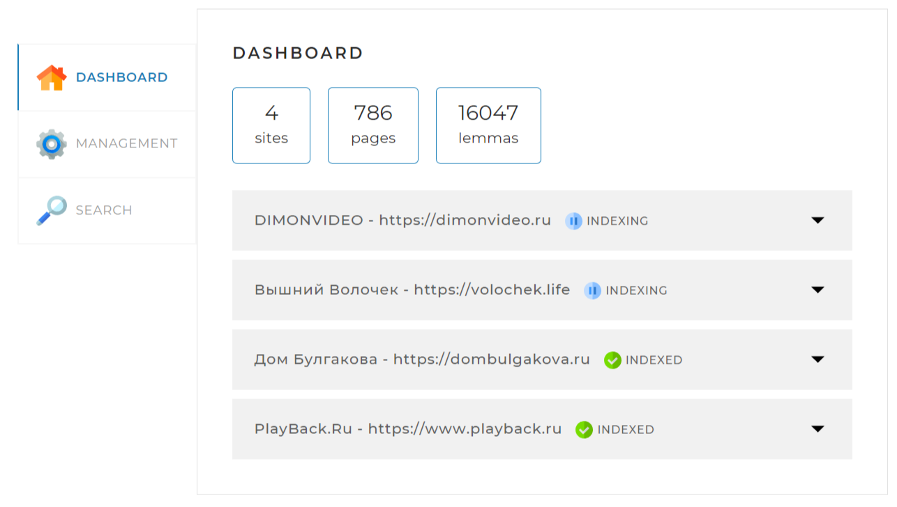
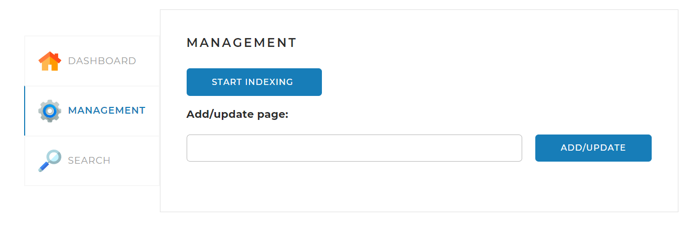

Поисковый движок – SearchEngine
______________________________________________________________________________________________________
Краткое описание    

Локальный поисковый движок, помогающий посетителям сайта находить необходимую информацию, используя поле поиска. Он представляет из себя Spring-приложение, работающее с локально установленной базой данных MySQL, имеющее простой веб-интерфейс и API, через который им можно управлять и получать результаты поисковой выдачи по запросу.
______________________________________________________________________________________________________
Инструкция по запуску           
  
• Установите систему управления базами данных;  
• Измените имя пользователя и пароль в файле конфигурации application.yaml;     
`username: root`                        
`password: root`            
• В базе данных создайте таблицу search_engine;         
• Запустите приложение с помощью класса Application;        
• В браузере перейдите на локальный хост http://localhost:8080/
_____________________________________________________________________________________________________
Функции

• Индексация сайтов;        
• Выдача основных данных по сайтам;     
• Поиск слов по сайтам, прошедших индексирование.
______________________________________________________________________________________________________
Содержание страницы

На странице у вас появятся три вкладки:
1. DASHBOARD
Эта вкладка открывается по умолчанию. На ней отображается общая статистика по всем сайтам, а также детальная статистика и статус по каждому из сайтов. 
3. MANAGEMENT
На этой вкладке находятся инструменты управления поисковым движком — запуск и остановка индексации, а также возможность обновить отдельную страницу по ссылке.
4. SEARCH
На этой вкладке находится поисковая строка и выпадающий список с выбором сайта для поиска. При нажатии на кнопку «SEARCH» (справа от поисковой строки) выводятся результаты поиска.
______________________________________________________________________________________________________
Стэк технологий   

• Hibernate     
• HTML  
• JavaScript    
• JSON  
• JSOUP     
• Maven     
• Morphology    
• Spring Boot   
• Spring Framework  
• SQL

